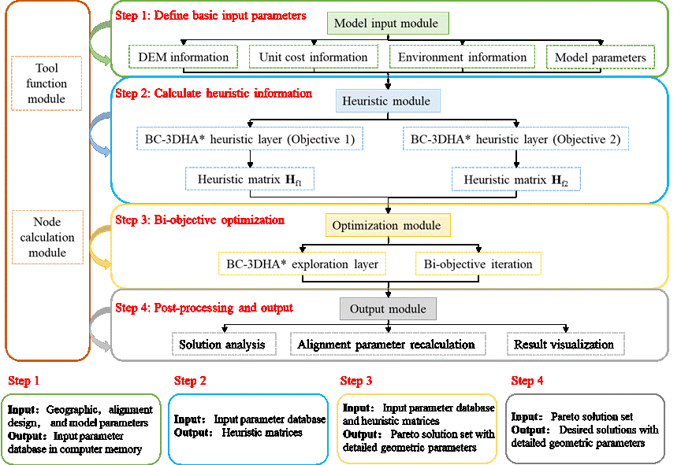
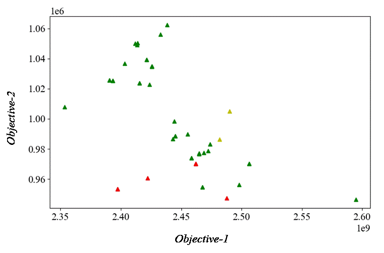
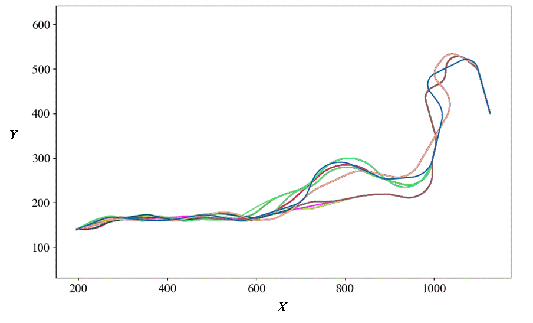
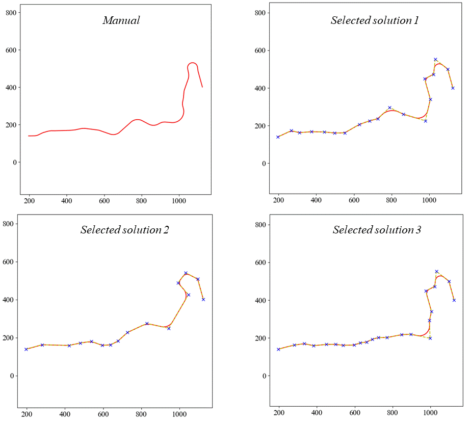
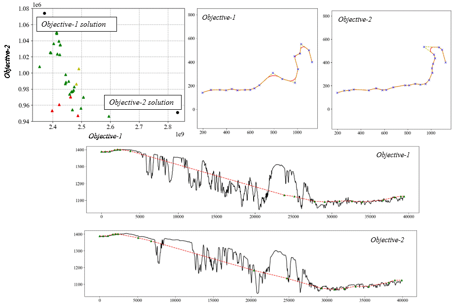

## Bidirectional Constrained Bi-objective 3D Hybrid A* (BCB-3DHA\*)

This repository contains the implementation of **BCB-3DHA\***, as presented in the paper ["A Bidirectional Bi-objective Graph Search Model for Sustainable Urban Railway Alignment Optimization"]. 

The purpose of this repository is to help readers understand and reproduce the algorithm described in the paper. Due to confidentiality requirements in real-world projects, some sensitive case study information (e.g., restricted area parameters, building spatial parameters, structural design parameters) is provided in processed parameter files rather than original design documents.

- **Author**: Tianglong Zhang  
- **Email**: zhangtianlong1995@gmail.com  

---

## Overview

Designing railway alignments in building-dense urban areas is a challenging task that requires considering both costs and impacts on existing buildings and the environment. Achieving a viable solution necessitates the application of computer-aided techniques for three-dimensional (3D) global path searches while simultaneously optimizing multiple objectives.

This study aims to optimize both comprehensive costs and carbon emissions of urban railway alignments. Building upon the [Hybrid A\*](https://ai.stanford.edu/~ddolgov/papers/dolgov_gpp_stair08.pdf), a robust and smooth graph search model, this paper integrates a bidirectional constraint-based 3D search strategy and a bi-objective optimization framework, leading to the proposal of a bi-objective graph search model, **BCB-3DHA\***. Additionally, the study introduces a novel method called discrete domain analysis to accurately and efficiently estimate building areas affected by optimized alignments, thus incorporating them into the optimization process.

For more details, please refer to the original paper.

---

## Dependencies

- Python 3.9  
- No third-party software dependencies

---

## Repository Structure

The execution of **BCB-3DHA\*** is divided into four main steps, as shown in the Figure 1.

 
**Figure 1**: The Four Execution Steps of BCB-3DHA*

### Files and Functions:
- **House_table.py**: House table processing
- **Exploration_area.py**: Exploration area processing (e.g., excluding restricted zones)
- **Input_paramters.py**: Defines alignment design parameters and algorithm model parameters
- **BC_3DHA_heuristic_cost.py**: Computes the heuristic cost matrix
- **BC_3DHA_heuristic_carbon.py**: Computes the heuristic carbon matrix
- **BCB_3DHA.py**: Main function
- **general_tool_functions.py**: Auxiliary functions (e.g., file reading/writing)
- **explore_coordinates_calculation.py**: Calculates exploration node coordinates
- **get_explore_cost_and_carbon.py**: Calculates exploration node costs and carbon emissions
- **merge_heuristic_cost_and_carbon.py**: Merges heuristic matrices for easier computation
- **Show_all_results.py**: Verifies and displays optimization results

As depicted in FIgure 2， the corresponding files in the repository correspond to these four steps is

 
**Figure 2**: Files Corresponding to the Four Steps in the Repository (from Figure 1）---

## How to Run

1. Run **BC_3DHA_heuristic_cost.py** and **BC_3DHA_heuristic_carbon.py** to obtain the heuristic matrices `h_cost.json` and `h_carbon.json`.
2. Run the main function **BCB_3DHA.py** to output the corresponding Pareto optimal solutions (`Optimized_alignments-*.json`).  
   (By modifying the `EXPLORE_RES` in **Input_paramters.py**, you can obtain different Pareto sets. Re-running the main function will not require recalculating `h_cost.json` and `h_carbon.json`.)
3. Run **Show_all_results.py** to display the optimized alignments.

---

## Results Output

1. Running **BC_3DHA_heuristic_cost.py** and **BC_3DHA_heuristic_carbon.py** generates the heuristic matrices `h_cost.json` and `h_carbon.json`. The corresponding optimal heuristic alignments will also be displayed (for visualization purposes and not used for the actual optimization process).

   Example output of the heuristic layer (Figure 3):

   
    **Figure 3**: Heuristic Layer File Execution Results
2. Running **BCB-3DHA.py** will output the solution set files corresponding to the current exploration resolution, e.g., `Optimized_alignments-300.json` if the default resolution of 300m is used. If you modify `EXPLORE_RES` in **Input_paramters.py** to 450m or 600m and rerun **BCB-3DHA.py**, it will output `Optimized_alignments-450.json` and `Optimized_alignments-600.json` accordingly.

3. Run **Show_all_results.py** to display all the computed results from the paper (Figure 4-7).
     
    **Figure 4**: Objective function values for each solution in the Pareto set
     
    **Figure 5**: Horizontal Alignment layout for each solution
     
    **Figure 6**: Comparison of manual solution vs. optimized solutions
     
    **Figure 7**: Vertical profile for each optimized alignment

---

## Single-objective Version

The repository also includes a single-objective version of the algorithm, modifed based on our related paper ["3D constrained Hybrid A*: Improved vehicle path planning algorithm for cost-effective road alignment design"](https://doi.org/10.1016/j.autcon.2024.105645). To differentiate from the bi-objective version, the single-objective version is referred to as **single-objective-BC-3DHA.py**.

The process for running the single-objective version is similar to the multi-objective version described above:

1. Set `SINGLE_OBJECTIVE = 1` in **Input_paramters.py** and run **single-objective-BC-3DHA.py** to obtain `Optimized_alignment-objective-1.json`.
2. Set `SINGLE_OBJECTIVE = 2` in **Input_paramters.py** and run **single-objective-BC-3DHA.py** again to obtain `Optimized_alignment-objective-2.json`.
3. Run **Single_objective_plot.py** to visualize the results.

   Example output for single-objective optimization (Figure 8):

   
   **Figure 8**: Optimization Results of the Single-objective BC-3DHA*

---

## Acknowledgments

This work was supported by [China Scholarship Council (Project number: 202307000086), the National Natural Science Foundation of China (Project number: 51878576 and U1934214), and Sichuan Nature and Science Foundation Innovation Research Group (Project number: 23NSFTD0031)].

---

